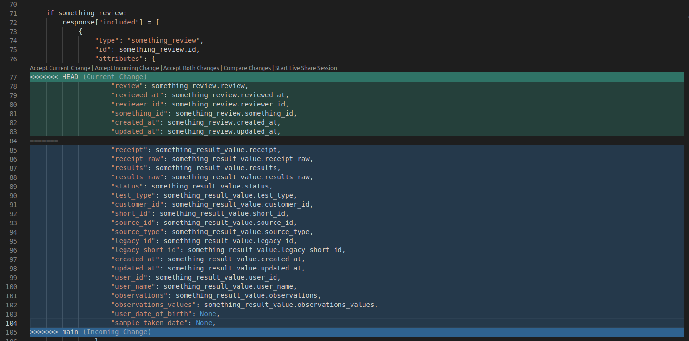

# Showing potential issues with merge strategies

## Context
There are two branches in this repo: `main` and a feature branch `feat/inverting-method` (not the best name but who cares). A one-liner change was added to `main` after the creation of the feature branch, so now it's conflicted. We can see how the change is just a new field in the response, [line 49 of `main.py`](https://github.com/ruromgar/git-merge-strategies/blob/37fa33d9b0feef6f8676abbf6fb6b42862ac4571/main.py#L49). 

In the feature branch there are two commits. The first one inverts the method so, instead of starting with _if response is OK_ it starts with _if response is not OK_. The second one, bigger, adds a new component (called `something_review`) to the response.

## Problem

Let's fix the conflict

## Solution 1: Git merge

Clone the repo and do a git merge

```
git clone https://github.com/ruromgar/git-merge-strategies.git
git checkout feat/inverting-method
git merge main
```

### Expected result

Git will add a bunch of lines to the `something_review`, allowing you to fix the conflict there. But we do know that the conflict is not really there.



## Solution 2: Git rebase

Clone the repo and do a git rebase

```
git clone https://github.com/ruromgar/git-merge-strategies.git
git checkout feat/inverting-method
git rebase main
```

### Expected result

Git will show the differences in the response, allowing you to fix the conflict there, where it actually is.


## Notes

Looks like GitHub itself performs a `merge` in the built-in tool - check it clicking on `Resolve conflicts` in the PR.